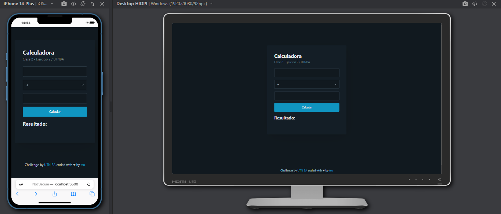

# Universidad Tecnológica Nacional Buenos Aires - Web Developer with React JS

## Class 2 - Exercise

This repository contains two exercises developed during Class 2 of the "Web Developer with React JS" course at Universidad Tecnológica Nacional Buenos Aires.

## Exercise 1

The second exercise involves developing a basic web calculator with the following features:

- Identify the purpose of the third parameter received in the function.
- Understand in what situations it is necessary to develop such functions.
- Make a call to the example function.

### Questions to answer

1. What is the third parameter received?
2. In what cases is it mandatory to develop such functions?

## Exercise 2

The second exercise involves developing a basic web calculator with the following features:

- 2 input fields for operands.
- 4 buttons for basic operators (addition, subtraction, multiplication, division).
- When an operation is performed, the result field is updated.

## Screenshot

